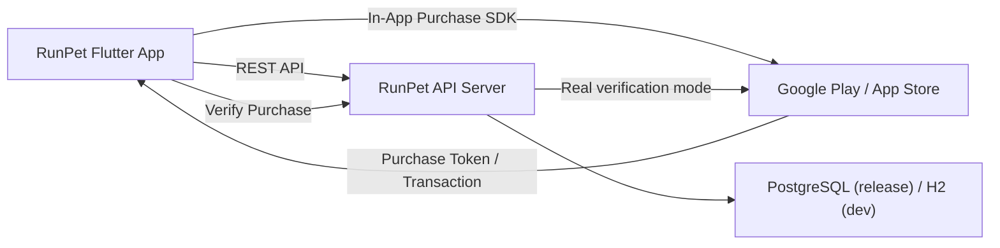

# RunPet App

## Run
### Dev mode
```powershell
cd D:\scan_work\runpet_app
.\scripts\run_dev.ps1
```

### Release mode
```powershell
cd D:\scan_work\runpet_app
.\scripts\run_release.ps1
```

### Release mode with custom API URL
```powershell
cd D:\scan_work\runpet_app
$env:API_BASE_URL="https://api.example.com"
.\scripts\run_release.ps1
```

## API base URL
- Android emulator: `http://10.0.2.2:8080`
- iOS/desktop/web: `http://localhost:8080`

Configured in `lib/config/app_config.dart`.

## .env Example (local shell env)
Flutter는 `.env` 파일을 자동 로드하지 않으므로 실행 전에 PowerShell 환경변수로 설정합니다.

```powershell
# dev
$env:APP_ENV="dev"

# release (optional override)
$env:APP_ENV="release"
$env:API_BASE_URL="https://api.example.com"
```

## System Architecture


## QA Documents
- `docs/user_scenarios.md`
- `docs/qa_test_cases.md`
- `docs/qa_execution_guide.md`

## In-app purchase
- Product IDs are configured in `lib/config/app_config.dart`.
- Purchase flow:
  1. query product details
  2. request purchase (`in_app_purchase`)
  3. receive purchase stream event
  4. verify on backend (`/api/v1/payments/verify`)

Note: real store verification requires backend env credentials.
