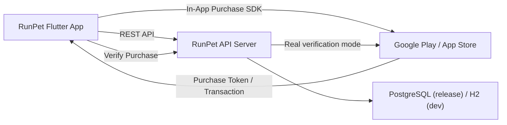

# RunPet App

## Run
### Dev mode
```powershell
cd D:\scan_work\runpet_app
.\scripts\run_dev.ps1
```

### Release mode
```powershell
cd D:\scan_work\runpet_app
.\scripts\run_release.ps1
```

### Release mode with custom API URL
```powershell
cd D:\scan_work\runpet_app
$env:API_BASE_URL="https://api.example.com"
.\scripts\run_release.ps1
```

## API base URL
- Android emulator: `http://10.0.2.2:8080`
- iOS/desktop/web: `http://localhost:8080`

Configured in `lib/config/app_config.dart`.

## .env Example (local shell env)
Flutter는 `.env` 파일을 자동 로드하지 않으므로 실행 전에 PowerShell 환경변수로 설정합니다.

```powershell
# dev
$env:APP_ENV="dev"

# release (optional override)
$env:APP_ENV="release"
$env:API_BASE_URL="https://api.example.com"
```

## System Architecture


## QA Documents
- `docs/user_scenarios.md`
- `docs/qa_test_cases.md`
- `docs/qa_execution_guide.md`

## In-app purchase
- Product IDs are configured in `lib/config/app_config.dart`.
- Purchase flow:
  1. query product details
  2. request purchase (`in_app_purchase`)
  3. receive purchase stream event
  4. verify on backend (`/api/v1/payments/verify`)

Note: real store verification requires backend env credentials.

## Running Map (Google Maps)
- Running tab now shows live route map (marker + polyline) while tracking.
- Dependency: `google_maps_flutter`
- Location points are collected from `geolocator` stream and rendered on map.

Android setup:
1. Put your key in `android/local.properties`
2. Add line: `GOOGLE_MAPS_API_KEY=YOUR_ANDROID_KEY`

iOS setup:
1. Open `ios/Runner.xcworkspace`
2. Set `GOOGLE_MAPS_API_KEY` build setting (or `.xcconfig`) with your iOS key

If key is missing, map may show blank tiles.

## Real 3D Pet (Web)
- Pet avatar uses real GLB rendering on web through `<model-viewer>`.
- Real GLB rendering is web-first in current implementation. Mobile/desktop app falls back to pseudo-3D widget.
- Default model URL: `https://modelviewer.dev/shared-assets/models/Fox.glb`
- Override flags:
  - `ENABLE_3D_PET=true|false`
  - `ENABLE_3D_RUNTIME_ATTACH=true|false`
  - `PET_3D_BASE_MODEL_URL=https://.../pet_base.glb`
  - `PET_3D_SLOT_MODEL_TEMPLATE_URL=https://.../{slot}_{id}.glb`
  - `PET_3D_MODEL_URL=https://.../your_pet.glb`
  - `PET_3D_MODEL_TEMPLATE_URL=https://.../pet_{hat}_{outfit}_{bg}.glb`

`ENABLE_3D_RUNTIME_ATTACH=true`:
- Uses one base model and attempts runtime slot attach on web (`slot_hat`, `slot_outfit`, `slot_bg_anchor`).
- `PET_3D_SLOT_MODEL_TEMPLATE_URL` resolves placeholders:
  - `{slot}` => `hat|outfit|bg`
  - `{id}` => equipped item id

Example:
```powershell
flutter run -d chrome --dart-define=ENABLE_3D_PET=true --dart-define=PET_3D_MODEL_URL=https://modelviewer.dev/shared-assets/models/Fox.glb
```

Runtime-attach example:
```powershell
flutter run -d chrome --dart-define=ENABLE_3D_PET=true --dart-define=ENABLE_3D_RUNTIME_ATTACH=true --dart-define=PET_3D_BASE_MODEL_URL=https://cdn.example.com/pet_base.glb --dart-define=PET_3D_SLOT_MODEL_TEMPLATE_URL=https://cdn.example.com/{slot}_{id}.glb
```

3D 슬롯 장착 규격 문서: `docs/3d_pet_slot_attach_spec.md`
